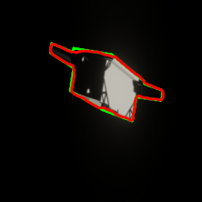
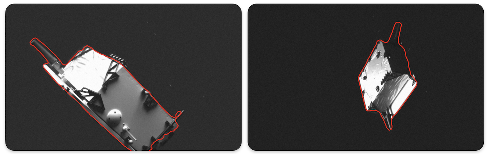
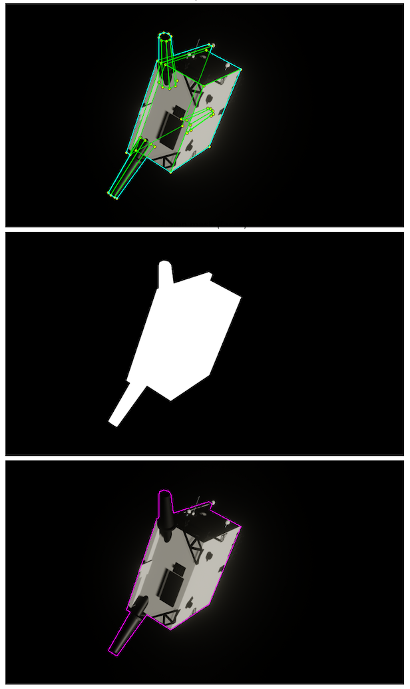

# Stage 1: Object Segmentation and Contour Detection

<p align="center">
  
  
  
</p>

This module implements the **first stage** of the 4-Stage Pipeline (4SP) for monocular spacecraft pose estimation. It performs **semantic segmentation** to detect and extract the target object (nanosatellite) from space imagery using a fine-tuned **Mask2Former** architecture.

---

## Overview

In autonomous space operations such as satellite servicing, debris removal, and orbital capture, accurate pose estimation of non-cooperative targets is essential. This pipeline extracts the angular pose (rotation in degrees around x, y, z axes) from a single monocular image through four sequential deep neural networks.

```
                              4-STAGE PIPELINE (4SP)

    +-----------+     +------------+     +------------+     +-----------+
    |  STAGE 1  | --> |  STAGE 2   | --> |  STAGE 3   | --> |  STAGE 4  |
    |  Contour  |     |  Visible   |     |  Hidden    |     |   Pose    |
    | Detection |     | Keypoints  |     | Keypoints  |     | Estimation|
    +-----------+     +------------+     +------------+     +-----------+
         |                  |                  |                  |
         v                  v                  v                  v
    Binary Mask        (x,y) coords       (x,y) coords      Quaternion
    + Bounding Box     of visible         of occluded       q = (w,x,y,z)
                       vertices           vertices
```

**This repository contains Stage 1: Contour Detection and Segmentation.**

---

## Architecture

Stage 1 employs a **Mask2Former** model - a masked-attention, set-prediction architecture for universal image segmentation. The model is fine-tuned via transfer learning for binary semantic segmentation (background vs. object).

```
                        MASK2FORMER ARCHITECTURE

    Input Image          Backbone              Decoder           Output
    (H x W x 3)         (Swin-Base)          (Transformer)      (Binary Mask)
        |                   |                     |                  |
        v                   v                     v                  v
    +-------+          +---------+          +-----------+       +--------+
    |  RGB  | -------> | Feature | -------> |  Masked   | ----> |  Mask  |
    | Image |          |  Maps   |          | Attention |       | H x W  |
    +-------+          +---------+          +-----------+       +--------+
                            |                     |
                            +---------------------+
                               Skip Connections
```

### Key Features

- **Transfer Learning**: Pre-trained on ADE20K, fine-tuned for spacecraft detection
- **Binary Segmentation**: Outputs a pixel-wise mask (0 = background, 1 = object)
- **Photometric Augmentation**: Gaussian blur and brightness reduction to simulate space conditions
- **No Geometric Augmentation**: Preserves spatial relationships for accurate localization

---

## Results

Performance metrics on 1,000 held-out synthetic images (256x256):

| Metric | Value |
|--------|-------|
| **mIoU** | 0.9602 |
| **Dice/F1** | 0.9797 |
| **Boundary-F** | 0.9528 |
| **Precision** | 0.9622 |
| **Recall** | 0.9436 |

The high Dice score and strong boundary F-measure indicate that predictions both cover the object interior and adhere closely to its contour, enabling stable downstream position readout.

### Example Outputs

#### Synthetic Data

Predicted contour (red) overlaid on ground truth (green) for synthetic test images:

<p align="center">
  
</p>

<p align="center"><em>Model output on synthetic data: Ground Truth (green) vs Prediction (red)</em></p>

#### Sim-to-Real Transfer (SPEED+ Dataset)

The model generalizes to real imagery despite being trained only on synthetic data, demonstrating that domain randomization captures the spatial statistics needed for real-world localization:

<p align="center">
  
</p>

<p align="center"><em>Zero-shot transfer to real SPEED+ dataset images without additional fine-tuning</em></p>

---

## Project Structure

```
Contour/
|-- preprocess_contour.py   # Dataset preparation and contour generation
|-- train_contour.py        # Mask2Former fine-tuning script
|-- eval_contour.py         # Model evaluation and metrics
|-- use_countour.py         # Inference on new images
|-- requirements.txt        # Python dependencies
|-- README.md               # This file
|
|-- X_data.npy              # (Generated) Input images (N, H, W, 3)
|-- Y_data.npy              # (Generated) Binary masks (N, H, W)
|-- mask2former_contour_finetuned/  # (Generated) Trained model
```

---

## Installation

```bash
# Clone the repository
git clone https://github.com/your-repo/4SP.git
cd 4SP/Contour

# Create virtual environment (recommended)
python -m venv venv
source venv/bin/activate  # On Windows: venv\Scripts\activate

# Install dependencies
pip install -r requirements.txt
```

### Requirements

- Python 3.10+
- PyTorch 2.4.1 (CUDA 12.1 supported)
- HuggingFace Transformers 4.55.0
- OpenCV, PIL, NumPy, SciPy, Matplotlib

---

## Usage

### 1. Preprocess Data

Generate the training dataset from JSON annotations and rendered images:

```bash
python preprocess_contour.py
```

The preprocessing pipeline extracts visible vertices from JSON annotations, computes face visibility, and generates binary segmentation masks:

<p align="center">
  
</p>

<p align="center"><em>Top: Visible vertices and face edges overlaid on input image<br/>Middle: Generated binary segmentation mask<br/>Bottom: Final contour boundary extraction</em></p>

**Configuration** (edit in script):
```python
JSON_DIR = "../Database/Only_Obj_Env/JSON_Data_MASK"
IMAGES_DIR = "../Database/Only_Obj_Env/Rendered_Images"
TARGET_SIZE = (256, 256)  # Output image dimensions
MAX_PAIRED_FILES = 40000  # Dataset size cap
```

**Outputs:**
- `X_data.npy` - Input images (N, 256, 256, 3)
- `Y_data.npy` - Binary segmentation masks (N, 256, 256)

### 2. Train the Model

Fine-tune Mask2Former on the preprocessed dataset:

```bash
python train_contour.py
```

**Hyperparameters** (edit in script):
```python
NUM_EPOCHS = 10
TRAIN_BATCH_SIZE = 1
LEARNING_RATE = 5e-5
WARMUP_RATIO = 0.1
TRAIN_VAL_SPLIT = 0.9
```

**Augmentation Settings:**
```python
AUGMENT_ENABLE = True
AUG_BLUR_PROB = 0.5
AUG_BLUR_SIGMA_RANGE = (0.2, 2.5)
AUG_DARKEN_PROB = 0.5
AUG_DARKEN_FACTOR_RANGE = (0.6, 0.95)
```

### 3. Evaluate the Model

Compute mIoU, Dice, and boundary metrics on validation data:

```bash
python eval_contour.py
```

**Configuration:**
```python
EVAL_NUM_SAMPLES = 1000
BOUNDARY_TOLERANCE_PX = 2
BOUNDARY_THICKNESS_PX = 1
```

### 4. Run Inference

Apply the trained model to new images:

```bash
python use_countour.py [model_dir] [images_dir] [output_dir]
```

**Outputs:**
- `Predictions/` - Contour overlays on original images
- `Predictions/ObjectOnly/` - Segmented objects with black background
- `Predictions/Cropped/` - Centered square crops around detected objects

---

## Data Augmentation

To handle extreme lighting and domain shifts common in space imagery, photometric augmentations are applied during training:

| Augmentation | Effect | Purpose |
|--------------|--------|---------|
| **Gaussian Blur** | Simulates defocus/motion blur | Optical and capture artifacts |
| **Brightness Reduction** | Darkens the image | Low-light space conditions |

**Important:** No geometric augmentations (crops, rotations, scaling) are used to preserve the spatial supervision that drives accurate localization.

```
+-------------+-------------+-------------+-------------+
|  Original   |  Blur 0.8   |  Blur 1.5   |  Blur 2.5   |
+-------------+-------------+-------------+-------------+
|  Original   |  Dark 0.9   |  Dark 0.75  |  Dark 0.6   |
+-------------+-------------+-------------+-------------+
| Blur+Dark   | Blur+Dark   | Blur+Dark   | Blur+Dark   |
|   0.5+0.9   |   1.0+0.8   |   1.5+0.7   |   2.5+0.6   |
+-------------+-------------+-------------+-------------+
```

---

## Synthetic Data Generation

The dataset is generated in Blender with:

- **Domain Randomization**: Varied lighting (low exposure to extreme illumination), Earth position/visibility, camera-object distance
- **Realistic Materials**: Metallic reflections producing bloom effects
- **Procedural Earth**: Randomized textures with normal maps and atmospheric effects
- **Two Mesh Types**:
  - **Low-poly mesh**: Preserves silhouette for contour determination
  - **Keypoint mesh**: Strategic vertex placement for geometric capture

---

## Pipeline Integration

The output from Stage 1 feeds directly into Stage 2:

```python
# Stage 1 Output
mask = model.predict(image)  # Binary mask (H, W)
bbox = compute_bounding_box(mask)  # (x_min, y_min, x_max, y_max)

# Crop for Stage 2 (Visible Keypoint Detection)
cropped_image = center_crop(image, bbox, target_size=1000)
cropped_image = place_on_black_background(cropped_image)
```

---

## Citation

If you use this code in your research, please cite:

```bibtex
@inproceedings{pagliaricci2025multistage,
  title={A Multi-Stage Deep Neural Network Approach for Angular Pose Estimation
         in Nanosatellite Capture},
  author={Pagliaricci, Daniel and Pazelli, Tatiana F. P. A. T.},
  booktitle={76th International Astronautical Congress (IAC 2025)},
  year={2025},
  organization={International Astronautical Federation (IAF)},
  address={Sydney, Australia}
}
```

---

## Acknowledgements

This work was supported by:
- National Council for Scientific and Technological Development (CNPq)
- National Fund for Scientific and Technological Development (FNDCT)
- Ministry of Science, Technology and Innovations (MCTI)

Process No. 407721/2022-3

---

## License

This project is part of ongoing research at the Federal University of Sao Carlos (UFSCar), Department of Electrical Engineering.

---

## Related Stages

| Stage | Description | Link |
|-------|-------------|------|
| **Stage 1** | Contour Detection (This module) | `Contour/` |
| **Stage 2** | Visible Vertex Detection | `Visible_Neural_Net/` |
| **Stage 3** | Non-Visible Vertex Estimation | `Invisible_Neural_Net/` |
| **Stage 4** | Angular Pose Estimation | `Rotation_Neural_Net/` |
