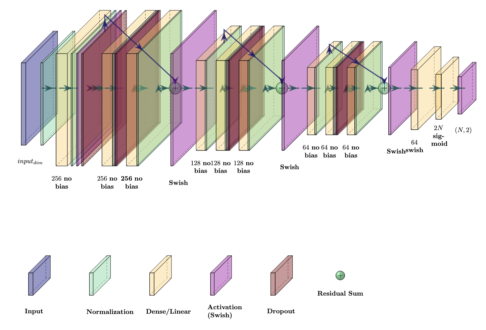

# Stage 3: Invisible Keypoints Neural Network -  Predicting Occluded Vertex Positions from Visible Geometry

This module estimates the 2D pixel coordinates of **non-visible (occluded) keypoints** on a spacecraft using only the positions of visible vertices and known mesh topology. It enables complete pose estimation even when parts of the object are hidden from view.

## Overview

In monocular spacecraft pose estimation, self-occlusion presents a fundamental challenge: some vertices are hidden from the camera's viewpoint. This neural network solves the **geometry completion problem** by inferring where occluded vertices project onto the image plane, using geometric relationships derived from visible keypoints.

### Key Features

- **Hybrid Feature Engineering**: Encodes vertex, edge, face, and convex hull relationships
- **Topology-Aware Design**: Leverages known mesh structure (edges, faces) for geometric reasoning
- **Visibility Gating**: Prevents information leakage from unobserved coordinates
- **Robust Augmentation**: Structured visibility flipping and positional noise for generalization

---

## Network Architecture



The architecture is a **residual MLP** specifically designed for heterogeneous geometric inputs:

| Component | Description |
|-----------|-------------|
| **Input Normalization** | Feature-wise normalization adapted on training data |
| **Dense Backbone** | Progressive width reduction (256 → 128 → 64) with residual connections |
| **Batch Normalization** | Stabilizes training across mixed-scale inputs |
| **Swish Activation** | Smooth non-linearity for better gradient flow |
| **Dropout** | Regularization to prevent overfitting |
| **Output Head** | Sigmoid activation yielding normalized [0,1] coordinates reshaped to V×2 |

---

## Hybrid Feature Construction

The network receives a carefully engineered feature vector encoding geometric relationships at multiple levels:

### Feature Blocks

| Block | Features | Description |
|-------|----------|-------------|
| **Vertex-level** | 3V features | `[visibility_flag, norm_x, norm_y]` per vertex |
| **Edge-level** | 3×\|E\| features | `[distance_norm, cos(θ), sin(θ)]` for visible edges |
| **Face-level** | 3×\|F\| features | Centroid `(x, y)` and normalized area per visible face |
| **Convex Hull** | 3 features | Normalized area, perimeter, and vertex count |

### Visibility Gating

To prevent label leakage, coordinates of non-visible vertices are **zeroed out** during feature computation. This forces the network to learn geometric inference rather than memorization.

---

## Data Augmentation


Augmentation operates on **inputs only**, never on supervision targets:

### Structured Visibility Flipping
- Randomly flips visible vertices to "non-visible" for feature computation
- Creates diverse partial-graph patterns the model may encounter at test time
- Capped maximum flips per sample to maintain reasonable difficulty

### Geometric Jitter
- Adds small Gaussian noise to pixel coordinates used for feature computation
- Simulates upstream keypoint detector noise
- Coordinates are clipped to image bounds

---

## Training

### Loss Function

**Weighted Masked Euclidean Loss** in pixel units:

```
L = Σ (m_v × w_v × ||Π(p̃_v) - Π(p̂_v)||₂) / (Σ m_v × w_v + ε)
```

Where:
- `m_v`: Loss mask (1 if vertex should be supervised)
- `w_v`: Class-aware weight (higher for truly non-visible vs. augmented)
- `Π`: Maps normalized to pixel coordinates

### Hyperparameters

| Parameter | Value |
|-----------|-------|
| Learning Rate | 3×10⁻⁴ |
| Batch Size | 64 |
| Hidden Dimension | 256 |
| Dropout Rate | 0.3 |
| L2 Regularization | 1×10⁻⁴ |
| Early Stopping Patience | 40 epochs |

---

## Prediction Output


The network outputs normalized coordinates for all vertices. At inference:
- **Visible vertices**: Use ground truth positions from upstream detector
- **Hidden vertices**: Use network predictions (shown as orange markers)

---

## Usage

### 1. Preprocess Data

Generate training data with hybrid features and augmentation:

```bash
python preprocess_invis.py
```

**Outputs:**
- `X_data.npy`: Hybrid feature vectors (N × feature_dim)
- `Y_data.npy`: Target coordinates and masks (N × V × 5)

### 2. Train the Model

```bash
python train_invis.py
```

**Outputs:**
- `BestModel/best_model_invisible.h5`: Best validation checkpoint
- `final_model_invisible.h5`: Final trained model
- `training_logs_invisible/`: Training curves and logs

### 3. Run Inference

```bash
python use_invis.py
```

**Features:**
- Test-Time Augmentation (TTA) with configurable noise
- Visualization of predictions vs. ground truth
- Feature vector visualization for debugging

---

## Results

Performance on held-out test set (different random seed):

| Metric | Value |
|--------|-------|
| MAE (x-axis) | 7.88 px |
| MAE (y-axis) | 8.03 px |
| Mean MAE | 7.96 px |

The balanced per-axis errors indicate no directional bias in predictions.

---

## Configuration

Key parameters in `preprocess_invis.py`:

```python
# Image dimensions for normalization
IMAGE_WIDTH = 1920
IMAGE_HEIGHT = 1080

# Augmentation parameters
AUGMENTATION_FLIP_PROBABILITY = 0.2
AUGMENTATION_POSITIONAL_NOISE_STDDEV_PIXELS = 3
AUGMENTATION_MAX_FLIPPED_VERTICES = 2

# Data multiplication factor
AMOUNT_DATA_PER_REAL_DATA = 5
```

---

## Directory Structure

```
Invisible_Keypoints/
├── preprocess_invis.py      # Data preprocessing and feature engineering
├── train_invis.py           # Model training script
├── use_invis.py             # Inference and visualization
├── X_data.npy               # Preprocessed input features (generated)
├── Y_data.npy               # Target coordinates (generated)
├── BestModel/               # Saved model checkpoints
└── README.md                # This file
```

---

## Dependencies

- Python 3.8+
- TensorFlow 2.x
- NumPy
- Matplotlib
- SciPy (for ConvexHull computation)
- PIL/Pillow

---

## Related Modules

| Stage | Module | Description |
|-------|--------|-------------|
| 1 | [Segmentation](../Contour/) | Object detection and mask generation |
| 2 | [Visible Keypoints](../Visible_Keypoints/) | Visible vertex detection |
| **3** | **Invisible Keypoints** | **Hidden vertex estimation (this module)** |
| 4 | [Rotation Neural Net](../Rotation/) | Quaternion pose regression |
