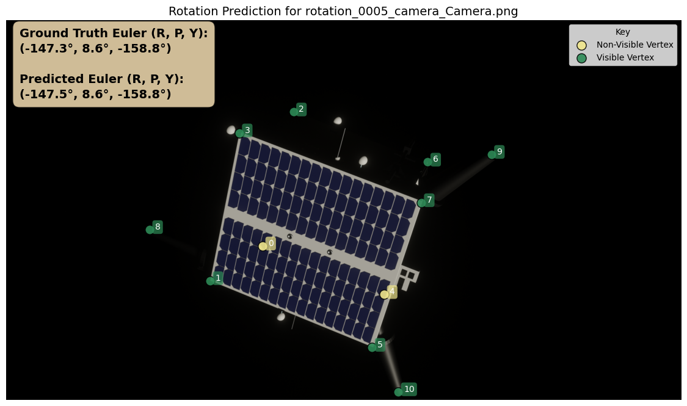

# Stage 4: Rotation Neural Network -  Angular Pose Estimation from 2D Keypoints

This module implements the final stage of the 4-Stage Pipeline (4SP) for monocular spacecraft pose estimation. It regresses unit quaternions directly from geometric features extracted from 2D keypoint coordinates, achieving sub-degree accuracy without requiring explicit camera calibration.

## Overview

The Rotation Neural Network takes hybrid geometric features computed from all detected keypoints (both visible and non-visible) and predicts the 3D orientation of the spacecraft as a unit quaternion. This approach leverages the known mesh topology to encode spatial relationships that constrain the pose solution.




## Key Features

- **Geodesic Loss Function**: Training uses geodesic distance on SO(3), which properly captures rotational geometry and respects the quaternion double-cover
- **Hybrid Feature Encoding**: Combines vertex positions, edge metrics, face centroids/areas, and convex hull statistics
- **Data Augmentation**: Two-scale pixel jitter simulates upstream keypoint detection noise
- **Residual MLP Architecture**: Deep network with skip connections for stable gradient flow

## Performance

Evaluated on a held-out synthetic dataset (N=1000 images):

| Metric | Value |
|--------|-------|
| Mean Orientation Error (E_R) | **0.30°** |
| Median Error | 0.22° |
| Standard Deviation | 1.04° |

**Per-Axis Errors (Euler angles for interpretability):**

| Axis | Mean | Median |
|------|------|--------|
| Roll (X) | 0.77° | 0.20° |
| Pitch (Y) | 0.15° | 0.12° |
| Yaw (Z) | 0.71° | 0.14° |

## Architecture

```
Input Features (D-dim)
        │
        ▼
┌───────────────────┐
│  Normalization    │
└───────────────────┘
        │
        ▼
┌───────────────────┐
│  Dense(512) + BN  │──┐
│  + Swish + Drop   │  │
└───────────────────┘  │
        │              │ Residual
        ▼              │
┌───────────────────┐  │
│  Residual Blocks  │◄─┘
│  512→256→128→64   │
└───────────────────┘
        │
        ▼
┌───────────────────┐
│  Dense(4) Linear  │
└───────────────────┘
        │
        ▼
┌───────────────────┐
│  Unit Normalize   │
│   q = z/||z||     │
└───────────────────┘
        │
        ▼
    Quaternion (w,x,y,z)
```

## Hybrid Feature Construction

The input feature vector encodes geometric relationships at multiple levels:


### Feature Components

1. **Vertex-Level (3V features)**
   - Visibility flag (0 or 1)
   - Normalized pixel coordinates (x/W, y/H)

2. **Edge-Level (3|E| features)**
   - Normalized distance between connected vertices
   - Angle encoding: (sin θ, cos θ) to avoid wrap-around discontinuities

3. **Face-Level (3|F| features)**
   - Normalized centroid coordinates per face
   - Projected area normalized by image dimensions

4. **Global Hull (3 features)**
   - Normalized convex hull area
   - Normalized perimeter
   - Fraction of vertices on hull

## Usage

### 1. Data Preprocessing

Prepare training data from JSON annotations containing keypoint coordinates and ground-truth quaternions:

```bash
python preprocess_rotation.py
```

**Configuration** (in `preprocess_rotation.py`):
```python
IMAGE_WIDTH = 1920
IMAGE_HEIGHT = 1080
AMOUNT_DATA_PER_REAL_DATA = 10  # Augmentation factor

# Noise parameters for augmentation
NOISE_SMALL_PX = 8.0   # Small noise for all vertices
NOISE_BIG_PX = 10.0    # Larger noise for subset
NOISE_MAX_BIG_VERTICES = 4
```

**Outputs:**
- `X_data.npy`: Hybrid feature vectors (N × D)
- `Y_data.npy`: Unit quaternions (N × 4)

### 2. Training

Train the rotation regression network:

```bash
python train_rotation.py
```

**Key Hyperparameters** (in `train_rotation.py`):
```python
LEARNING_RATE = 1e-4
WEIGHT_DECAY = 1e-4
BATCH_SIZE = 512
EPOCHS = 100
DROP_OUT_RATE = 0.1
TRAIN_VAL_SPLIT_RATIO = 0.8
```

**Outputs:**
- `models/best_model.keras`: Best validation checkpoint
- `models/final_model.keras`: Final trained model
- `models/training_history.png`: Loss curves

### 3. Inference

Run predictions on new data:

```bash
python use_rotation.py
```

**Outputs:**
- Per-sample predictions with error analysis
- Visualization overlays comparing ground truth vs predicted Euler angles
- Metrics summary (JSON and CSV)

## Geodesic Loss Function

The training loss measures angular mismatch on SO(3):

```
L(q, q̂) = 2 * arccos(clip(|⟨q, q̂⟩|, -1, 1-ε))
```

Where:
- `q` is the ground-truth unit quaternion
- `q̂` is the predicted unit quaternion
- `ε > 0` prevents numerical instability at arccos(1)

The absolute value handles quaternion double-cover (q and -q represent the same rotation).

## File Structure

```
Rotation/
├── preprocess_rotation.py  # Data preprocessing and augmentation
├── train_rotation.py       # Model training script
├── use_rotation.py         # Inference and evaluation
├── utils.py                # Utility functions (quaternions, features)
├── saves/                  # Preprocessed data batches
├── models/                 # Trained model checkpoints
└── use_plots/              # Visualization outputs
```

## Data Format

### Input JSON Structure

```json
{
  "visible_vertices": [
    {"index": 0, "pixel_coordinates": [x, y]},
    ...
  ],
  "non_visible_vertices": [
    {"index": 3, "pixel_coordinates": [x, y]},
    ...
  ],
  "rotation_quaternion": {"w": 0.5, "x": 0.5, "y": 0.5, "z": 0.5}
}
```

### Mesh Information JSON

```json
{
  "total_vertices": 11,
  "edge_composition": [[0,1], [1,2], ...],
  "face_composition": [[0,1,2,3], ...]
}
```

## Comparison with Classical Methods

| Metric | 4SP (Ours) | EPnP+RANSAC |
|--------|------------|-------------|
| Mean E_R | **0.30°** | 1.26° |
| Median | **0.22°** | 1.06° |
| RMS | **1.08°** | 1.62° |

The 4SP pipeline achieves lower orientation error without requiring explicit camera calibration, as intrinsic parameters are implicitly learned through the feature construction.

## Requirements

- Python 3.8+
- TensorFlow 2.x
- NumPy
- SciPy
- Matplotlib

## Related Modules

| Stage | Module | Description |
|-------|--------|-------------|
| 1 | [Segmentation](../Contour/) | Object detection and mask generation |
| 2 | [Visible Keypoints](../Visible_Keypoints/) | Visible vertex detection |
| 3 | [Invisible Keypoints](../Invisible_Keypoints/) | Hidden vertex estimation (this module) |
| **4** | **Rotation Neural Net** | **Quaternion pose regression** |