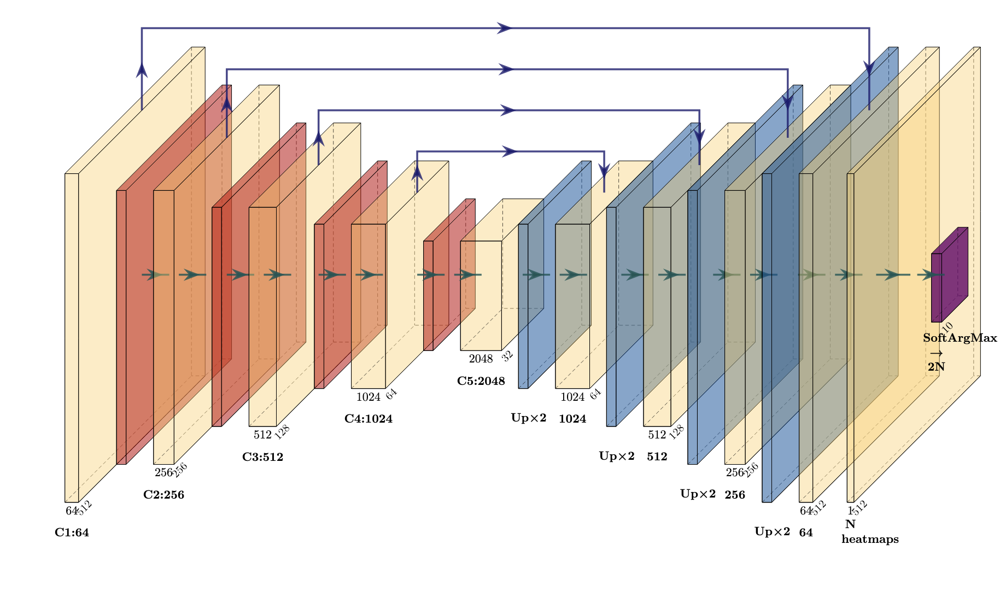
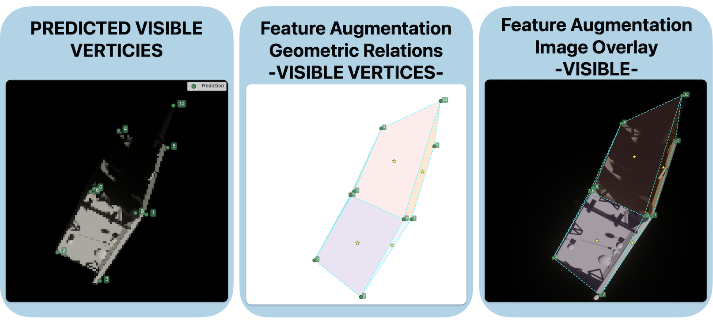
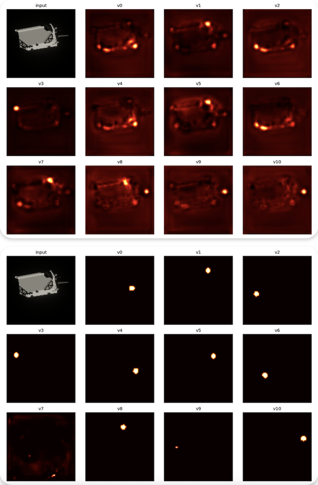

# Stage 2: Visible Keypoints Detection

This module implements the **second stage** of the 4-Stage Pipeline (4SP) for monocular spacecraft pose estimation. Given a cropped image of the target object, the network predicts the 2D pixel coordinates of all **visible keypoints** (vertices) using a heatmap regression approach.

## Overview

The visible keypoint detector is a U-Net style encoder-decoder network with a ResNet-50 backbone. It produces per-keypoint Gaussian heatmaps and extracts precise coordinates using a differentiable **SoftArgMax** layer, enabling end-to-end training with sub-pixel accuracy.



**Key Features:**
- ResNet-50 encoder with ImageNet pretrained weights
- Multi-scale skip connections for fine-grained localization
- Temperature-scaled SoftArgMax for differentiable coordinate extraction
- Focal loss to handle class imbalance between keypoint peaks and background
- Supports variable number of keypoints based on mesh topology

## Architecture

| Component | Description |
|-----------|-------------|
| **Encoder** | ResNet-50 backbone (frozen during initial training) |
| **Decoder** | 4 upsampling stages with skip connections |
| **Output** | 64x64 heatmaps per keypoint + normalized (x,y) coordinates |
| **Input Size** | 128x128 RGB |
| **Heatmap Size** | 64x64 per keypoint |

### SoftArgMax Layer

Instead of using non-differentiable argmax, a temperature-scaled spatial softmax extracts continuous coordinates:

```
p_ij = exp(β * S_ij) / Σ exp(β * S_uv)
x̂ = Σ p_ij * j,    ŷ = Σ p_ij * i
```

Where `β = 15` controls the sharpness of the distribution, allowing gradients to flow from coordinate losses back into the heatmap predictor.

## Training

### Data Preparation

The preprocessing script generates training data from rendered images and JSON annotations:

```bash
python preprocess_vis.py
```

This creates:
- `X_data.npy`: Preprocessed images (N, 128, 128, 3)
- `Y_data.npz`: Heatmaps and normalized coordinates

### Image Preprocessing Pipeline

1. Resize with padding to 1920x1080 canvas
2. Center crop to 1000x1000
3. Downscale to 128x128
4. Apply ResNet-50 preprocessing (BGR + mean subtraction)

### Data Augmentation

Photometric augmentations preserve spatial accuracy while improving robustness:



- **Gaussian blur**: Simulates optical artifacts and motion blur
- **Brightness reduction**: Mimics low-light space conditions
- No geometric augmentations to preserve keypoint alignment

### Training the Model

```bash
python train_vis.py
```

**Training Configuration:**
| Parameter | Value |
|-----------|-------|
| Batch Size | 128 |
| Initial LR | 5e-4 |
| Fine-tune LR | 2e-6 |
| Validation Split | 15% |
| Backbone | Frozen initially |

### Loss Function

The total loss combines two terms:

```
L = L_focal-heat + λ * L_masked-L1
```

- **Focal Heatmap Loss** (α=0.25, γ=2): Handles severe class imbalance between small peaks and background
- **Masked L1 Loss** (λ=5): Supervises coordinate regression only for visible keypoints

## Inference

```bash
python use_vis.py
```

The inference script:
1. Loads the trained model (`visible_keypoints_model.keras`)
2. Processes images through the preprocessing pipeline
3. Predicts heatmaps and extracts coordinates
4. Optionally maps predictions back to original image coordinates
5. Generates visualization overlays

### Output Files

```
predictions/
├── overlays/           # Predicted keypoints on images
├── heatmaps/           # Per-vertex heatmap visualizations
├── original_overlays/  # Predictions mapped to original resolution
└── evaluation_summary.json
```

## Results

### Heatmap Evolution During Training

The network learns to produce sharp, unimodal peaks centered on keypoint locations:



*Top: Epoch 5 - diffuse, multi-modal heatmaps with high uncertainty*
*Bottom: Final epoch - sharp, confident peaks at vertex locations*

### Quantitative Performance

Evaluated on 1000 held-out synthetic images (7,680 visible keypoints):

| Metric | Value |
|--------|-------|
| MAE (Δx, Δy) | (0.35, 0.35) px |
| RMSE (Δx, Δy) | (0.80, 0.83) px |
| Euclidean Mean | 0.54 px |
| Euclidean Median | 0.36 px |
| Euclidean P95 | 1.63 px |

### PCK (Percentage of Correct Keypoints)

| Threshold | Accuracy |
|-----------|----------|
| ≤ 2 px | 96.85% |
| ≤ 5 px | 99.82% |
| ≤ 10 px | 99.96% |

## Configuration

Key parameters in `preprocess_vis.py`:

```python
IMG_SZ = 128        # Input image size
HEAT_SZ = 64        # Heatmap resolution
SIGMA_PX = 2.0      # Gaussian spread for heatmap targets
CROP_HEIGHT = 1000  # Center crop dimensions
CROP_WIDTH = 1000
```

Key parameters in `train_vis.py`:

```python
BATCH = 128
EPOCHS = 20
VAL_SPL = 0.15
LAMBDA_L1 = 5.0     # Coordinate loss weight
LR = 5e-4           # Initial learning rate
USE_FINE_TUNE = False
```

## File Structure

```
Visible_Keypoints/
├── preprocess_vis.py   # Data preprocessing and heatmap generation
├── train_vis.py        # Model architecture and training loop
├── use_vis.py          # Inference and evaluation
├── logs/               # TensorBoard logs and checkpoints
├── plots/              # Training visualizations
└── predictions/        # Inference outputs
```

## Dependencies

- TensorFlow >= 2.x
- NumPy
- Matplotlib
- PIL (Pillow)
- tqdm (optional)

## References

This implementation is based on the methodology described in:

Key architectural inspirations:
- [U-Net](https://arxiv.org/abs/1505.04597) - Encoder-decoder with skip connections
- [ResNet](https://arxiv.org/abs/1512.03385) - Deep residual learning
- [Focal Loss](https://arxiv.org/abs/1708.02002) - Addressing class imbalance
- [Integral Human Pose Regression](https://arxiv.org/abs/1711.08229) - SoftArgMax for coordinate extraction
